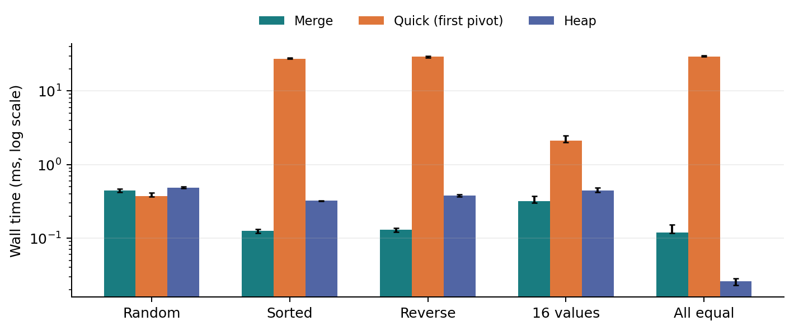
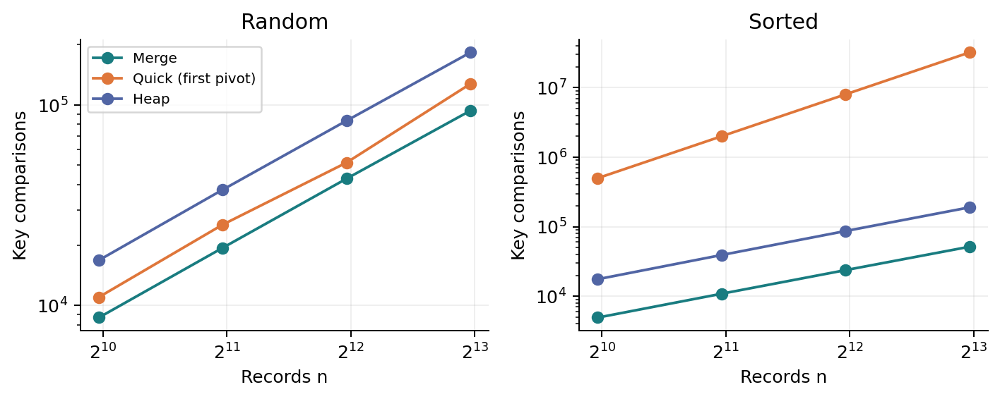
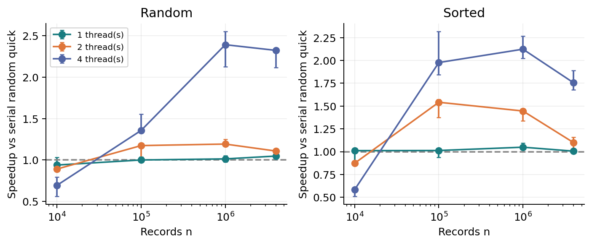

# 같은 정렬 문제, 다른 비용

**병합·퀵·힙 정렬 비교와 랜덤 퀵 정렬의 병렬화 실험**

GitHub 저장소: <link href="https://github.com/snowcover1535/sorting-hw1-2026" color="#176e9b">https://github.com/snowcover1535/sorting-hw1-2026</link>


## 1. 무엇을 비교할 것인가

같은 데이터를 정렬하더라도 알고리즘이 수행하는 일과 사용하는 자원은 다르다. 이 과제에서는 수업에서 배운 병합 정렬과 퀵 정렬, 아직 배우지 않은 힙 정렬을 직접 구현했다. 실행시간만으로 순위를 매기기보다 입력 상태가 바뀔 때 성능 차이가 생기는 이유를 비교 횟수와 연결해 살펴본다.

| 구분 | 선택한 정렬 | 비교하려는 특징 |
| --- | --- | --- |
| 배운 정렬 1 | 병합 정렬 | 안정성과 O(n log n)의 시간, O(n) 보조 배열 |
| 배운 정렬 2 | 퀵 정렬 | 첫 피벗 선택과 입력 순서에 따른 성능 변화 |
| 배우지 않은 정렬 | 힙 정렬 | 최악 O(n log n), 반복형 구현의 O(1) 보조 공간 |

추가로 교수님이 제안하신 단일·다중 스레드 비교를 진행했다. 병렬 퀵 정렬을 세 번째 정렬로 세지는 않았다. 필수 비교는 위 세 종류로 충족하고, 병렬화는 퀵 정렬 내부의 별도 확장 실험으로 구분했다.


## 2. 실험 전에 세운 예상

첫 원소를 피벗으로 쓰면 오름차순 입력에서 한쪽 부분 문제가 계속 비므로 퀵 정렬의 비교 횟수는 제곱에 비례해 증가할 것이다. 병합 정렬과 힙 정렬은 같은 입력에서도 O(n log n)의 상한을 유지할 것이다. 병렬화는 작업이 충분히 클 때 이득이 생기며, 스레드 수만큼 그대로 빨라지지는 않을 것으로 예상했다.


## 3. 샘플에서 참고한 부분과 바꾼 부분

제공된 hw1-sample-2026의 코드 구성, 동일 입력 복사, 태그를 이용한 안정성 검사, 원본 CSV와 그래프를 함께 남기는 방식을 참고했다. 정렬 구현과 실험은 새로 작성했다. 샘플의 clock() 대신 omp_get_wtime()을 사용해 병렬화에서도 사용자가 기다리는 시간을 측정했다. 비교·이동 횟수는 별도 계측 빌드에서 산출했다. [1]

AI 활용 범위: 정렬 선택과 실험 설계, C 코드·테스트·그래프·보고서 초안 작성에 ChatGPT를 사용했다. 수치는 이 작업 환경에서 실제 실행한 결과이며, 제출자 PC에서 측정한 값으로 표시하지 않았다. 힙 정렬 학습 내용은 2쪽에 첨부했다.


# 힙 정렬은 어떻게 동작하는가

AI 학습 정리: ChatGPT를 통해 힙의 구조·동작·복잡도를 학습하고, 프린스턴 알고리즘 자료의 sink와 힙 구성 설명으로 확인했다. [3]

힙 정렬은 배열을 **최대 힙(max heap)**으로 만든 뒤 가장 큰 값을 뒤쪽으로 하나씩 확정하는 정렬이다. 최대 힙에서는 부모의 키가 자식의 키 이상이다. 형제 사이까지 정렬할 필요는 없으며, 루트가 최댓값이라는 점을 이용한다. [3]

선택 정렬은 매번 전체 구간을 훑어 최댓값을 찾지만, 힙 정렬은 힙을 유지해 최댓값을 바로 꺼내고 O(log n)에 구조를 복구한다. 따라서 선택 정렬의 O(n²)을 최악 O(n log n)으로 줄인다.


## 배열을 트리처럼 읽기

0부터 시작하는 인덱스 i의 왼쪽 자식은 2i+1, 오른쪽 자식은 2i+2이다. 별도의 노드나 포인터를 만들지 않아도 배열 자체를 완전 이진 트리로 볼 수 있다. sink는 더 큰 자식과 부모를 비교하고, 부모가 작으면 교환하며 아래로 내려가는 연산이다.

| 단계 | 배열의 상태 | 의미 |
| --- | --- | --- |
| 입력 | 4, 10, 3, 5, 1 | 아직 힙이 아님 |
| 힙 구성 | 10, 5, 3, 4, 1 | 마지막 부모부터 sink |
| 최댓값 10 확정 | 5, 4, 3, 1 \| 10 | 루트와 끝 교환 후 힙 복구 |
| 최댓값 5 확정 | 4, 1, 3 \| 5, 10 | 남은 구간만 힙으로 유지 |
| 최댓값 4 확정 | 3, 1 \| 4, 5, 10 | 정렬된 뒤쪽이 늘어남 |
| 완료 | 1 \| 3, 4, 5, 10 | 전체가 오름차순 |

```text
HEAPSORT(A, n)
  for i = floor(n/2)-1 down to 0:
    SINK(A, i, n)
  for end = n-1 down to 1:
    SWAP(A[0], A[end])
    SINK(A, 0, end)
```


## 왜 O(n log n)인가

힙 구성은 O(n)이다. 모든 노드가 루트 높이만큼 내려가는 것이 아니라, 대부분은 잎에 가깝다. 높이 h의 노드는 대략 n/2^(h+1)개이므로 전체 비용은 높이별 비용 n·h/2^(h+1)을 더한 값이며, 상수 배의 n으로 제한된다. 이후 최댓값을 꺼내는 작업을 n-1회 하며, 각 sink는 최대 O(log n)이므로 전체 최악 시간은 O(n log n)이다.

반복문으로 sink를 구현했으므로 보조 공간은 O(1)이다. 다만 루트와 끝을 교환하는 동안 같은 키의 원래 순서가 바뀔 수 있어 안정 정렬은 아니다. 예를 들어 (2,A), (2,B), (1,C)를 이 코드로 정렬하면 (1,C), (2,B), (2,A)가 된다. A와 B의 순서가 뒤집힌다.

주의: 이 구현은 모든 키가 같으면 sink가 일찍 끝나 O(n)에 가깝게 동작할 수 있다. 따라서 힙 정렬의 모든 입력에서 반드시 n log n에 비례하는 시간이 걸린다고 주장하지 않는다.

같은 O(n log n)이라도 비교·대입·메모리 접근에 따라 실행시간은 다르다. 힙 정렬이 퀵보다 항상 빠른 것은 아니며, 이번 결과는 4~5쪽에서 비교한다. 캐시 미스는 직접 측정하지 않았다.


# 공정하게 재기 위한 실험 조건

| 항목 | 설정 |
| --- | --- |
| 환경 | Linux x86-64 공유 가상 환경 / AMD EPYC 9V74 표기 |
| CPU 제약 | CPU affinity 9개, cgroup quota 8 CPU 상당량 |
| 컴파일 | GCC 13.3.0 / C17 / -O2 -Wall -Wextra -Wpedantic -fopenmp |
| 원소 | Record { int key; int tag; } / 이 환경에서 8바이트 |
| 기본 실험 | n = 1,000 / 2,000 / 4,000 / 8,000; 5가지 입력 |
| 반복 | 조건별 준비 실행 1회 + 시간 측정 7회; 중앙값과 IQR |
| 정확성 | qsort와 키 비교 + 태그 중복·누락·키 변조 검사 |


## 입력 생성과 반복의 의미

무작위 입력은 0부터 n-1까지의 서로 다른 정수를 고정 시드로 섞었다. 오름차순과 역순도 서로 다른 값으로 구성했다. 중복 입력은 0~15의 값으로 만들고, 동일 값 입력은 모두 7로 채웠다. 입력용 시드는 20260929+n×17+입력종류 번호이며, 정확한 생성식은 src/main.c에 있다.

같은 조건의 모든 알고리즘과 7회 반복에는 동일 배열을 복사해 사용했다. 측정 순서는 반복마다 순환했다. 따라서 IQR은 **고정 입력에 대한 실행시간 변동**이며, 서로 다른 데이터나 피벗 시드의 변동을 뜻하지 않는다. 중간에 느린 측정값도 임의로 제거하지 않았다.


## 시간에 포함한 것과 제외한 것

입력 생성·배열 복사·qsort 정답 생성·정확성 확인·로그 출력은 측정 구간 밖에 두었다. 정렬 함수 안의 작업과 병합용 배열의 할당·해제는 포함했다. 병렬 버전은 parallel 영역 진입·종료와 task 관리 비용도 포함했다. 프로세스 시작과 조건별 첫 준비 실행은 제외했다.

비교·이동 횟수는 COUNT_OPS 빌드에서 별도로 측정했다. 시간 빌드에서는 이 두 카운터가 제거된다. 다만 기본 정렬의 재귀 깊이 갱신은 남아 있다. 이동은 swap의 임시 대입 3회와 병합 시 레코드 대입을 세며, 피벗 지역 복사는 제외한다. 전체 메모리 트래픽의 측정값은 아니다.


## 검증 결과

빈 배열, 1개 원소, 음수·최솟값·최댓값, 정렬·역순·동일 값, n=0~257, 중복 무작위 배열, 큰 병렬 작업을 검사했다. 테스트 1,837개가 모두 통과했다. 전체 시간 측정 644회와 계측 60회도 모두 정확성 검사를 통과했다. ASan·UBSan 실행은 통과했으며, LeakSanitizer는 /proc 접근 제한으로 비활성화했다. 따라서 누수 검사 통과를 주장하지 않는다.


# 입력 상태가 순위를 바꾼다

n=8,000, 각 조건 7회 실행의 중앙값(ms). 그래프의 오차 막대는 제1사분위수~제3사분위수(IQR)이고, 세로축은 로그 축이다.



| 입력 | 병합 (ms) | 퀵·첫 피벗 (ms) | 힙 (ms) |
| --- | --- | --- | --- |
| 무작위 | 0.446 | 0.376 | 0.488 |
| 오름차순 | 0.126 | 27.573 | 0.322 |
| 역순 | 0.130 | 29.183 | 0.380 |
| 16개 값 중복 | 0.321 | 2.097 | 0.444 |
| 모두 같은 값 | 0.118 | 29.167 | 0.026 |


## 결과 해석

무작위 입력에서는 퀵 정렬이 0.376ms로 가장 빨랐다. 그러나 오름차순에서는 27.573ms로, 병합 정렬보다 약 219.4배 느렸다. 첫 피벗이 계속 최솟값이 되어 한 번에 원소 하나만 확정하기 때문이다.

중복이 많거나 모든 값이 같을 때도 첫 피벗 퀵 정렬은 느려졌다. 이 파티션은 피벗보다 작은 값만 왼쪽으로 보내므로 같은 값이 계속 한쪽에 남는다. 모든 값이 같으면 피벗을 랜덤으로 골라도 이 문제는 해결되지 않는다. 중복에는 3-way partition 같은 별도 개선이 필요하다.

힙 정렬은 무작위 입력에서 병합·퀵보다 느렸지만 최악의 비교량이 제곱으로 증가하지 않는다. 모두 같은 값에서는 부모와 자식의 비교 후 sink가 바로 멈추어 이번 실험에서 가장 빨랐다. 구현의 조기 종료 조건이 결과에 반영된 것이다.


# 시간 차이를 비교 횟수로 설명하기



| n | 정렬 입력: 퀵 비교 | 직전 n 대비 배수 | n(n-1)/2와 일치 |
| --- | --- | --- | --- |
| 1,000 | 499,500 | - | 예 |
| 2,000 | 1,999,000 | 4.002 | 예 |
| 4,000 | 7,998,000 | 4.001 | 예 |
| 8,000 | 31,996,000 | 4.001 | 예 |

n이 2배가 될 때 정렬 입력의 퀵 비교 횟수는 약 4배가 된다. 반면 n=8,000의 무작위 입력에서는 병합 93,657회, 퀵 127,454회, 힙 182,759회였다. 이때 퀵이 병합보다 비교를 더 했는데도 시간은 짧았다. 비교 횟수만으로 실제 시간을 완전히 설명할 수 없으며 대입·할당·메모리 접근 등도 영향을 준다.

| 구분 | 병합 | 첫 피벗 퀵 | 힙 |
| --- | --- | --- | --- |
| 최악 시간 | O(n log n) | O(n²) | O(n log n) |
| 보조 공간 | O(n) 배열 + O(log n) 스택 | 이 구현: O(log n) 스택 | O(1) |
| n=8,000 보조 배열 | 64,000 B | 0 B | 0 B |
| 무작위 입력 재귀 깊이 | 14 | 9 | 0 (재귀 없음) |
| 16개 값 입력 안정성 | 유지 | 위반 관측 | 위반 관측 |

퀵 정렬은 작은 쪽만 재귀 호출하고 큰 쪽은 반복문으로 처리했다. 따라서 교안의 양쪽 재귀 구현과 달리 실제 스택은 최악에도 O(log n)으로 제한된다. 하지만 비교 횟수의 O(n²)은 그대로다. 보조 배열이 0바이트라는 말은 전체 추가 메모리가 0이라는 뜻이 아니다.

안정성은 key만으로 정렬한 뒤 동일 key의 tag 순서를 검사했다. 서로 다른 값만 있으면 안정성 위반을 볼 수 없다. 불안정 정렬이 특정 입력에서 순서를 유지했다고 해서 안정 정렬이 되는 것도 아니다. 병렬 런타임의 스택·task 메모리는 이 표의 측정 대상이 아니다.


# 멀티스레드 퀵 정렬의 비교 설계

기본 실험의 첫 피벗 방식과 병렬화를 바로 비교하면 피벗 개선 효과와 병렬화 효과가 섞인다. 그래서 확장 실험은 **동일한 랜덤 피벗 퀵 정렬**을 직렬과 OpenMP 1·2·4스레드로 실행했다. 스레드는 실행 흐름이고 코어는 이를 처리하는 하드웨어 자원이다. 스레드 4개가 전용 물리 코어 4개를 보장하지는 않는다.


## 동일 작업을 나누기 위한 조건

피벗을 정한 뒤 왼쪽과 오른쪽 구간은 겹치지 않으므로 각각 task로 실행할 수 있다. 초기 피벗 시드는 20260929로 고정하고, 각 부분 트리의 시드를 부모에서 독립적으로 파생했다. 전역 rand()를 공유하지 않으므로 스레드 실행 순서가 달라도 같은 분할 트리와 결과를 만든다.

```text
parallel region (threads = 1, 2, 4)
  single:
    taskQuickSort(A, seed, budget=8)

taskQuickSort(range):
  if size < 16384 or budget == 0: serialQuickSort(range)
  else: partition; spawn left/right tasks; taskwait
```

작은 구간까지 task를 생성하면 관리 비용이 커지므로 16,384개 미만 또는 task 분할 깊이 8에 도달하면 직렬로 처리했다. 이 값은 실험 전에 고정했으며 최적값 탐색은 하지 않았다. OMP_PROC_BIND=spread, OMP_PLACES=cores, OMP_WAIT_POLICY=PASSIVE로 실행했다. [4]

| 입력 / n | 직렬 (ms) | OMP 1 (ms) | OMP 2 (ms) | OMP 4 (ms) |
| --- | --- | --- | --- | --- |
| 무작위 / 10,000 | 0.545 | 0.589 | 0.623 | 0.766 |
| 무작위 / 100,000 | 7.014 | 6.915 | 6.023 | 5.136 |
| 무작위 / 1,000,000 | 90.789 | 88.141 | 76.129 | 37.521 |
| 무작위 / 4,000,000 | 381.237 | 363.734 | 343.069 | 176.381 |
| 정렬 / 10,000 | 0.205 | 0.206 | 0.235 | 0.374 |
| 정렬 / 100,000 | 3.432 | 3.330 | 2.437 | 1.701 |
| 정렬 / 1,000,000 | 44.045 | 41.610 | 32.482 | 21.376 |
| 정렬 / 4,000,000 | 176.078 | 173.705 | 160.166 | 94.111 |

위 표는 조건별 7회 중앙값이다. 무작위·정렬 입력은 모두 서로 다른 키이며, 중복 대량 입력으로 일반화하지 않는다. 실제 생성된 팀의 스레드 수가 1·2·4인지 각 측정에서 확인했다. 준비 실행 이후에도 각 정렬 호출의 병렬 영역 진입·종료와 task 대기 비용을 포함했다.


# 병렬화의 이득과 한계



속도 향상 = 직렬 시간 / 병렬 시간. 그래프는 같은 반복 번호끼리 계산한 비율 7개의 중앙값과 IQR이다. 1보다 크면 병렬이 빠르다. 아래 본문의 배수는 시간 중앙값끼리의 비율이므로 그래프의 점과 약간 다를 수 있다.


## 커지면 빨라지지만 4배는 아니었다

400만 개 무작위 입력에서 직렬은 381.237ms, 4스레드는 176.381ms였다. 중앙값 기준 약 2.16배 빨라졌다. 정렬 입력에서는 약 1.87배였다. 4스레드가 네 배 속도를 내지는 않았다.

첫 파티션은 한 스레드가 처리하며, 이후에도 분할이 치우치면 일부 스레드가 기다린다. task 생성·동기화 비용도 남는다. 균형 분할의 partition 경로 비용은 n+n/2+n/4+…이며, 깊이 제한 이후에는 부분 배열의 직렬 정렬 비용이 추가된다.

10,000개 입력은 task 생성 기준보다 작아 내부 정렬이 직렬이다. 병렬 영역 진입 비용을 보는 대조군이다. OMP 1의 작은 시간 차이도 실행 경로·캐시·시간 변동의 영향을 받으므로 병렬 효과로 해석하지 않는다.


## 결론과 적용 범위

병합 정렬은 안정성이 필요하고 O(n) 보조 배열을 허용할 때 적합하다. 힙 정렬은 작은 보조 공간과 최악 O(n log n)이 장점이다. 퀵 정렬은 무작위 입력에서 빨랐지만 피벗·중복 처리에 민감했다. 병렬화는 충분히 큰 문제와 좋은 분할에서 유효했다.

한계: 공유 가상 환경에서 조건별 입력·피벗 시드 각 1개로 측정했다. cgroup throttling 증가는 없었지만 호스트 부하는 통제하지 못했다. 다중 시드 반복, task 기준 최적화, 3-way partition, 실제 메모리 측정은 후속 과제다.


## 참고자료

[1] 과제 샘플: https://github.com/lec-algorithm/hw1-sample-2026 (commit 19b0aa6); 환경: https://github.com/lec-algorithm/algorithm-env

[2] 강의자료: 주제 03 「분할 정복과 머지 정렬」, 주제 04 「랜덤과 퀵 정렬」 11~23, 31~32쪽. 정렬 목록 선정: https://en.wikipedia.org/wiki/Sorting_algorithm#Comparison_of_algorithms

[3] Sedgewick·Wayne, Algorithms 4/e, Priority Queues: https://algs4.cs.princeton.edu/24pq/.

[4] OpenMP API 5.0, task: https://openmp.org/spec-html/5.0/openmpsu46.html ; taskwait: https://openmp.org/spec-html/5.0/openmpsu93.html

자료 확인: 2026-09-29. 샘플의 실험 수치는 재사용하지 않았다.
